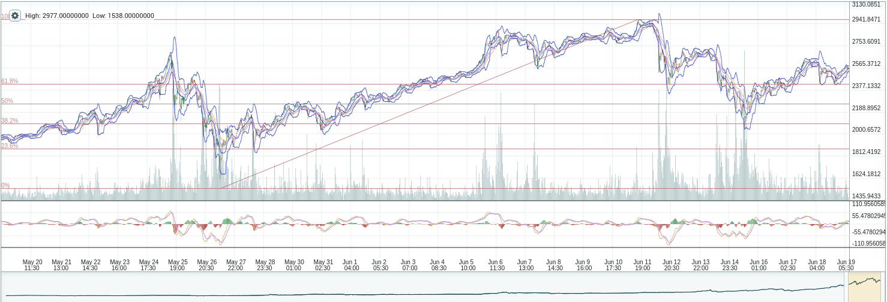

# gitMunny
#### A foray into reinforcement learning aiming to profitably trade with Deep-Q Networks

## Initial Goals
The ultimate goals of the gitMunny project are quite far reaching; however, the most important first-step is to successfully train an 'agent' to make trading decisions using reinforcement learning.
- This was done using standard cryptocurrency price data (close, high low, open, etc.), and the algorithm succeeded in making "informed" decisions, which tended to be profitable. There are some caveats to this, which will be discussed below.

## A Brief Overview of Reinforcement Learning

- **Agents** are a class of algorithms wich make choices once they are deployed. Many ML algorithms can be described as **agents**.
- These **agents** are generally trained using either **Unsupervised Learning** (where the algorithm finds patterns and similarities in the given data) and **Supervised Learning** (where the algorithm is trained using known labels or values, also called **targets**)
- In a **reinforcement learning** algorithm, neither of these descriptors is quite right. As the algorithm is being trained, it learns not from given labels or values, but rather receives a reward for any given action it decides to take. This reward is determined by a policy, and can be negative or positive. In each **episode** (iteration through a training loop), the algorithm learns from this reward.
- **Deep-Q Networks** are one method of deploying reinforcement learning to neural networks. For each **state** of the **environment** (the framework of data and rules through which the agent acts and receives rewards), the network predicts Q-values for each possible action the agent can take. These Q-values represent the expected sum of rewards. The **action** is the index of the maximum of these Q-values.
- **Training Data** in a RL algorithm can be rather tricky, as the agent has no prior knowledge of the environment (or state space), so it must first begin by making random actions, and learning from the rewards it receives. In essence, the algorithm generates the training values itself, then trains on them.  

| | 1,000 steps | 5,000 steps | 10,000 steps|
|---| --- | --- | ---|
|Trading Summary|  |  | |

###Learning Progress

### References
[The Self Learning Quant](https://hackernoon.com/the-self-learning-quant-d3329fcc9915)
[Eder Santana -- github](https://github.com/EderSantana/X)
[PyTrader](https://github.com/owocki/pytrader/)
