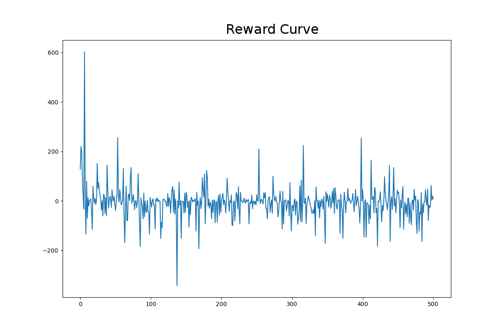

# gitMunny
#### A foray into reinforcement learning aiming to profitably trade with Deep-Q Networks

## Initial Goals
The ultimate goals of the gitMunny project are quite far reaching; however, the most important first-step is to successfully train an 'agent' to make trading decisions using reinforcement learning.
- This was done using standard cryptocurrency price data (close, high low, open, etc.), and the algorithm succeeded in making "informed" decisions, which tended to be profitable. There are some caveats to this, which will be discussed below.

## A Brief Overview of Reinforcement Learning

- **Agents** are a class of algorithms wich make choices once they are deployed. Many ML algorithms can be described as **agents**.
- These **agents** are generally trained using either **Unsupervised Learning** (where the algorithm finds patterns and similarities in the given data) and **Supervised Learning** (where the algorithm is trained using known labels or values, also called **targets**)
- In a **reinforcement learning** algorithm, neither of these descriptors is quite right. As the algorithm is being trained, it learns not from given labels or values, but rather receives a reward for any given action it decides to take. This reward is determined by a policy, and can be negative or positive. In each **episode** (iteration through a training loop), the algorithm learns from this reward.
- **Deep-Q Networks** are one method of deploying reinforcement learning to neural networks. For each **state** of the **environment** (the framework of data and rules through which the agent acts and receives rewards), the network predicts Q-values for each possible action the agent can take. These Q-values represent the expected sum of rewards. The **action** is the index of the maximum of these Q-values.
- **Training Data** in a RL algorithm can be rather tricky, as the agent has no prior knowledge of the environment (or state space), so it must first begin by making random actions, and learning from the rewards it receives. In essence, the algorithm generates the training values itself, then trains on them.  

| | 1,000 steps | 5,000 steps | 10,000 steps|
|---| --- | --- | ---|
|Trading Summary|  |  | |

####Discussion:
As we can see in the plots above, even after 10000 iterations, the trader, while collecting a tidy profit, is doing so with very few actual trades, even though it would ideally be able to increase that profit margin with some higher frequency margin trading.

There are several reasons this could be happening:
- Improper use of Scaler.
-- Using a standard scaler, as the MinMaxScaler lead to vanishing gradients.
-- I likely scaled the data in the wrong place. I am currently working on that in the `pretty` branch.
- Consistent upward trend in the data.
-- RNNs can easily overfit, and with a nearly constant upward trending dataset, it decided to buy everything it could early on.
- I limited the amount of trades the algorithm could do by giving it initial values for `Cash` and `Coins.` If it tried to buy some amount of BitCoin, but had no cash, it was not allowed to.
-- This aspect of the process is outside the training of the RNN, and could lead to the results we see above
###Learning Progress
10000 iterations (progress plotted for every 20th episode)

1000 iterations (using Nadam optimizer instead of SGD)

These learning progress plots are rather noisy, as is to be expected. I would expect that if I had had the time to let it run for a couple of days, the noise would decrease significantly. I also believe that my algorithm, with a few more tweaks, and running for more iterations (100,000 +), it could learn to be a very profitable Quant!

The next step in this process is to organize the algorithm into classes and, eventually, engineer a form of NLP as another predictive feature.

## USING DOCKER
To build the Dockerfile, run
`sudo docker-compose build`
then, to run the API, run
`sudo docker-compose up`

To hit the api, run
`$curl http://<localhost>:80/ -d "funds=<funds to trade>" -X PUT`
which will return a JSON object containing information regarding the trade recommendation.

### References
-[The Self Learning Quant](https://hackernoon.com/the-self-learning-quant-d3329fcc9915)

-[Eder Santana -- github](https://github.com/EderSantana/X)

-[PyTrader](https://github.com/owocki/pytrader/)
